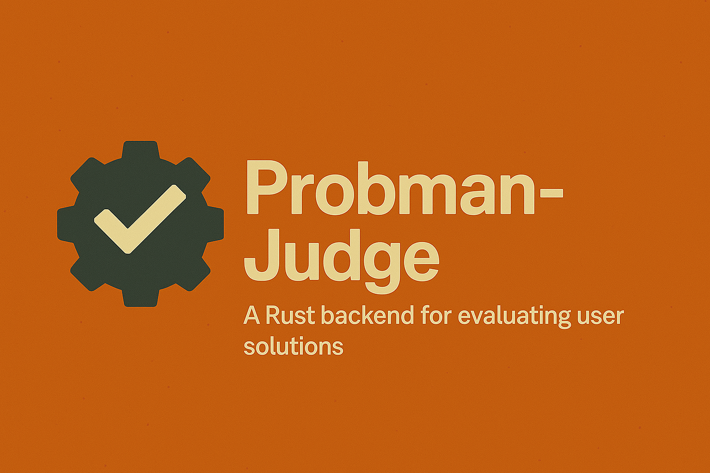

  

# Probman-Judge

**Probman-Judge** is the engine behind the magic—an open-source Rust backend designed to securely evaluate competitive programming solutions at scale. Built on **Actix-Web** for high-performance web handling, this judge system runs submitted code in isolated **Docker** containers on a **remote EC2 instance**, ensuring consistency and safety across evaluations.

It features **Redis-backed queuing** to handle a high throughput of submissions, supports custom **problem definitions and test cases**, and is fully modular so you can plug it into your competitive programming toolchain (like [Probman](https://github.com/your-org/probman)) or use it standalone as your evaluation backend.

---

# Probman-Judge Development Checklist

The following checklist outlines completed milestones and upcoming goals for the `probman-judge` project. With a solid backend in place, we’re focused on building the features that make scaling and real-time evaluation seamless.

## ✅ Implemented

- [x] Rust backend powered by Actix-Web
- [x] Secure, containerized solution execution using Docker
- [x] Remote execution environment deployed on AWS EC2
- [x] Redis-based queuing system for submission handling
- [x] API routes for submitting and managing problems & test cases
- [x] Extensible architecture for plug-and-play judge components

## 🔄 In Progress / Planned

- [ ] Sandbox hardening with resource and time limits
- [ ] Output comparison and grading logic
- [ ] Rate-limiting and error handling for incoming requests
- [ ] CLI tool for interacting with the judge directly
- [ ] CI integration and full test coverage (unit + integration)
- [ ] Webhook support for callback-based result delivery
- [ ] API documentation and deployment guide

---

Probman-Judge brings the scale, security, and performance you need for real-world code evaluation—all built in Rust, because speed *should* be a feature.

