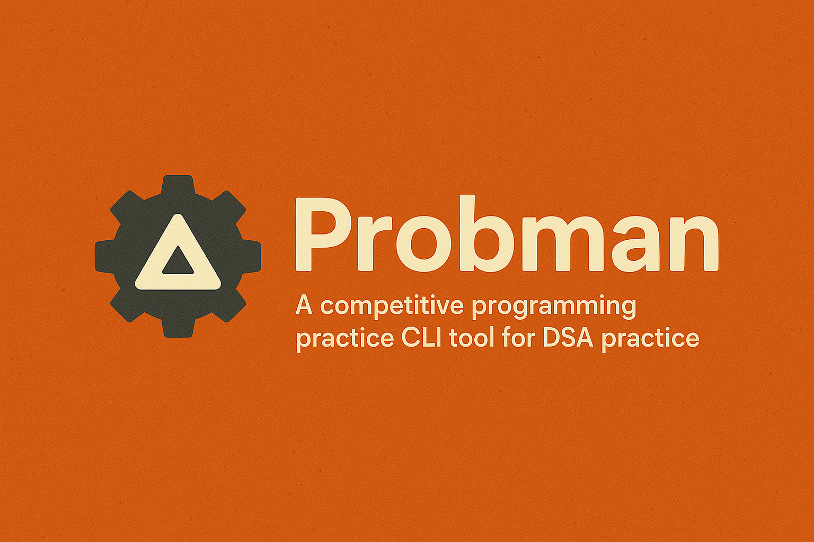

  

# Probman

**Probman** (short for *Problem Manager*) is an open-source CLI tool in development designed to streamline the management and evaluation of programming problems. The project is currently centered around a Rust-based backend that exposes a REST API for managing problems, test cases, and code submissions. Built with Actix-Web and SQLx, the backend interfaces with a PostgreSQL database and includes structured migrations, route definitions, and data models for the core entities. While unit tests and the CLI interface are still under development, the backend is fully functional and serves as the foundation of the system.

---

# Probman Development Checklist

The following checklist outlines the current progress and planned components of the Probman project. Completed items reflect the functional backend that is already in place, while remaining tasks indicate features under active development or planned for future implementation.

## ✅ Implemented

- [x] Rust-based backend service using Actix-Web
- [x] PostgreSQL integration with SQLx
- [x] Core models for problems, test cases, and submissions
- [x] REST API routes for managing entities
- [x] Database migrations using SQLx
- [x] API structure designed with future extensibility in mind

## 🔄 In Progress / Planned

- [ ] CLI tool for interacting with the backend
- [ ] Submission evaluation logic (sandboxing and result comparison)
- [ ] Unit and integration tests for backend routes and models
- [ ] User authentication and authorization (optional future scope)
- [ ] Docker-based deployment environment
- [ ] Documentation for API usage and CLI commands
